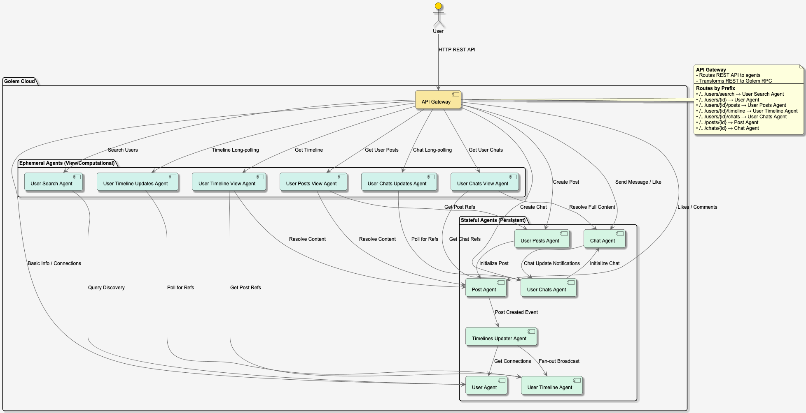

# golem-social-net-ts

## Overview
This is a simple social networking application built with an agent-based architecture and TypeScript, leveraging Golem Cloud for distributed, stateful agents.



*Figure 1: Golem Social Net Application Architecture*

## Architecture Components

### Agents
The application follows a granular agent-based architecture, where different aspects of the system are managed by specialized Golem agents:

#### Stateful Agents (Persistent)
- **User Agent**: Manages user profile information (name, email) and maintains a list of connections (friends and followers).
- **User Index Agent**: Maintains a sharded registry of all user IDs in the system across multiple shards, automatically tracking when new users are created. Uses MD5-based consistent hashing for distribution.
- **Post Agent**: Manages the lifecycle of an individual post, including its content, likes, and a hierarchical comment system.
- **User Posts Agent**: Maintains a registry of all posts created by a specific user.
- **User Timeline Agent**: Stores references to posts that should appear in a user's personal timeline.
- **Timelines Updater Agent**: Orchestrates the distribution of new posts to the timelines of the author and their connections.
- **Chat Agent**: Manages a single chat room, its participants, and its message history (including likes).
- **User Chats Agent**: Maintains a registry of all active chats for a specific user.

#### Ephemeral Agents (View/Computational)
- **User Search Agent**: Performs global user searches by querying all User Index Agent shards in parallel for user IDs and then retrieving user profiles in parallel chunks.
- **User Posts View Agent**: Generates a detailed view of a user's posts by aggregating content from multiple Post Agents.
- **User Timeline View Agent**: Generates a detailed view of a user's timeline by aggregating content from multiple Post Agents.
- **User Timeline Updates Agent**: Implements a long-polling mechanism to provide real-time updates for a user's timeline.
- **User Chats View Agent**: Aggregates full chat content for a user by querying multiple Chat Agents.
- **User Chats Updates Agent**: Implements a long-polling mechanism to provide real-time notification of new messages or chats.

### Frontend
The application includes a web-based frontend built with Vue 3, TypeScript, Vite, and Tailwind CSS.

For detailed information on how to set up, build, and run the frontend, including its backend proxy configuration, please refer to the [Frontend README](./frontend/README.md).

### Key Features
- **RESTful API** for all social net operations
- **Stateful Agents** with Golem Cloud managing the state
- **Distributed Agent System** with clear responsibility boundaries

### Communication Flow
The system manages interactions through a mix of synchronous RPC calls and asynchronous invocations:

1. **Request Entry & Routing**:
   - The **API Gateway** acts as the entry point, receiving HTTP REST requests from the frontend.
   - It maps these requests to specific **Golem RPC** calls targeting the appropriate agent (e.g., `/users/{id}` maps to a `User Agent`).

2. **Discovery & Search**:
   - **User Agent** automatically registers new users with the appropriate **User Index Agent** shard based on MD5 hashing when created.
   - **User Search Agent** (ephemeral) queries all **User Index Agent** shards in parallel for all user IDs, then retrieves user profiles in parallel chunks for efficient processing.

3. **Content Aggregation (Materialized Views)**:
   - **View Agents** (User Posts View, User Timeline View) handle complex read operations.
   - They first retrieve a list of post references (IDs and timestamps) from stateful registry agents (**User Posts Agent** or **User Timeline Agent**).
   - They then resolve these references by fetching full content, likes, and comments from multiple **Post Agents** in parallel.

4. **Asynchronous Post Distribution (Fan-out)**:
   - When a **Post Agent** is initialized, it asynchronously invokes the **Timelines Updater Agent**. This is a durable, guaranteed operation.
   - The **Timelines Updater Agent** receives the updates and identifies the author's connections via the **User Agent**.
   - It then performs a fan-out broadcast, adding the post reference to the **User Timeline Agent** of every follower and friend.

5. **Real-time Synchronization**:
   - The **User Timeline Updates Agent** and **User Chats Updates Agent** implement long-polling mechanisms.
   - They monitor stateful agents (**User Timeline Agent** and **User Chats Agent**) and return new references as soon as they are updated, allowing for live UI updates without constant full-page refreshes.

6. **Private Messaging & Group Chats**:
   - When a user initiates a chat, a **User Chats Agent** (stateful) initializes a new **Chat Agent**.
   - The **Chat Agent** handles all messages and reactions, and notifies the **User Chats Agent** for each participant whenever an update occurs.
   - Read operations are optimized through the **User Chats View Agent**, which handles parallel resolution of chat metadata and content.

### State Management
All core agents (User, User Index, Post, User Posts, User Timeline) have their state managed by Golem Cloud, ensuring reliability and scalability through the agent-based architecture.


## Quick Start

1. **Prerequisites**:
   - Install [Golem CLI](https://learn.golem.cloud/cli) (version 1.4.0+)
   - [Running Golem Environment](https://learn.golem.cloud/quickstart#running-golem)

   See [Golem Quickstart](https://learn.golem.cloud/quickstart) for more information.


2. **Build and Deploy**:
   ```bash
   # Build all components
   golem-cli build
   
   # Deploy to Golem
   golem-cli deploy
   ```

3. **Import Sample Data**:
   For information on importing sample data, see the [Data README](./data/README.md).

