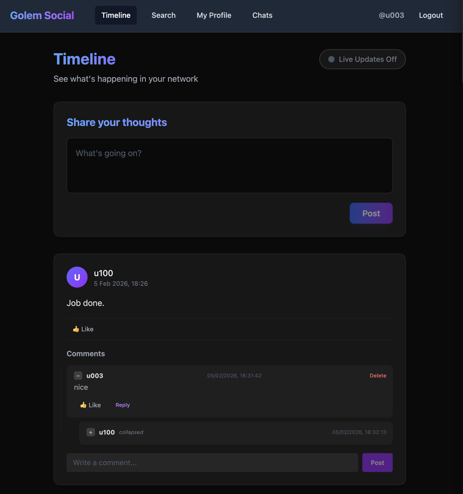
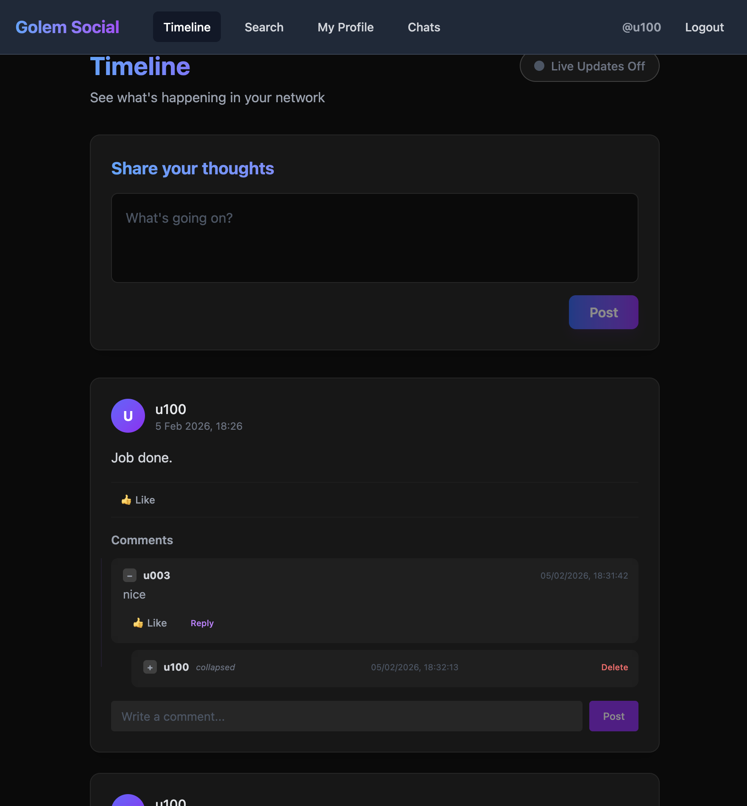
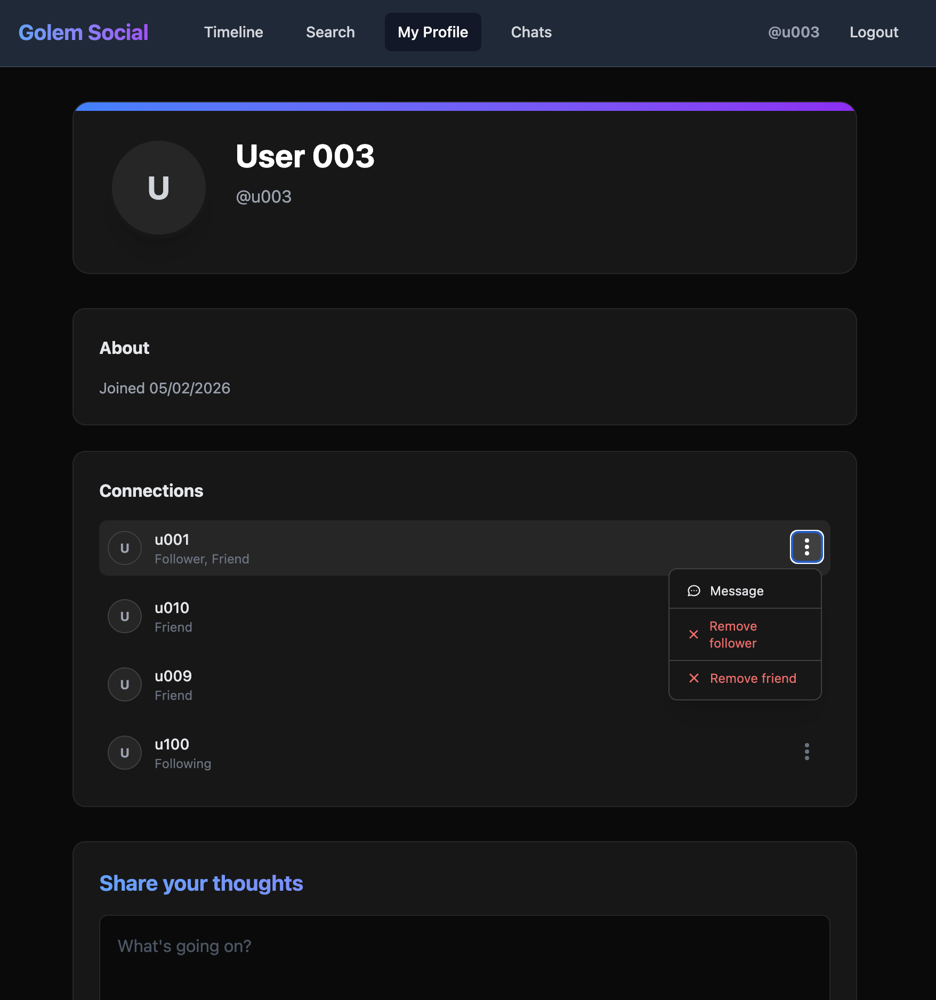
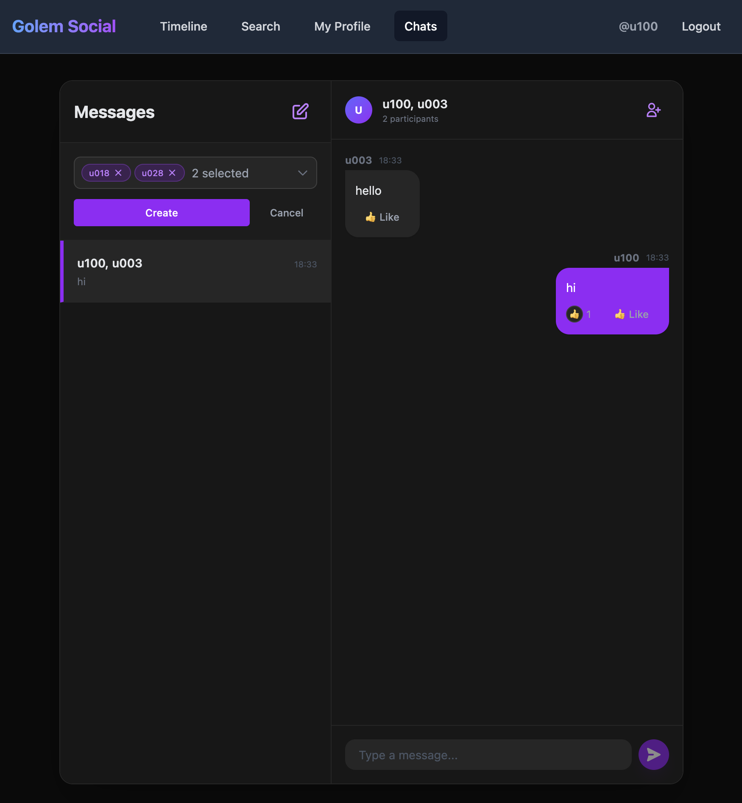
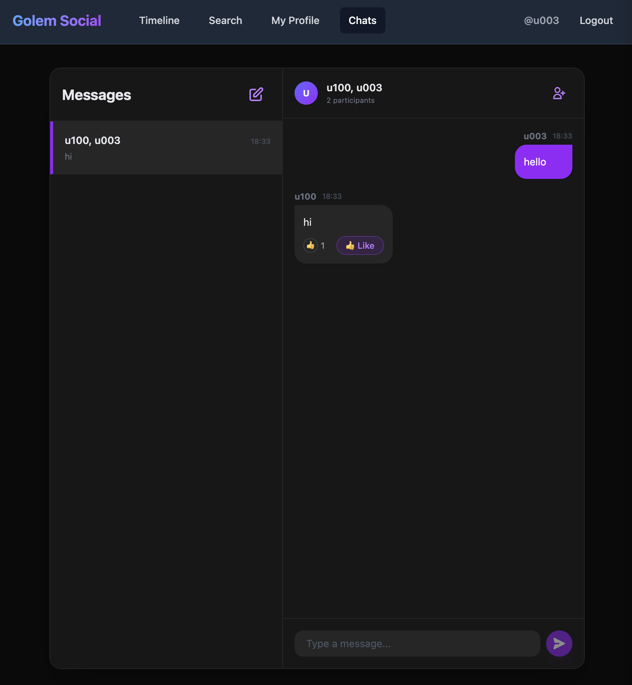

# Golem Social Net - Frontend

This is the frontend for the Golem Social Net application, built with Vue 3, TypeScript, and Vite.


## Prerequisites

- Node.js (version 18 or later)
- npm (version 9 or later) or yarn

## Getting Started

Install dependencies

```bash
npm install
```

## Available Scripts

- `npm run dev` - Start the development server
- `npm run build` - Build for production
- `npm run preview` - Preview the production build locally

## Backend Configuration

The frontend development server includes a proxy configuration for API requests.

- **Backend Port**: `9006` (configured in `vite.config.ts`)
- **Proxy**: Requests to `/api` are automatically proxied to `http://localhost:9006`.

Ensure your Golem backend is running and listening on port `9006` for the frontend to function correctly.

## Development Workflow

```bash
npm run dev
```
The application will be available at `http://localhost:3000`


## Screenshots

<div>
  <h3>Timeline</h3>
  
  

<h3>Profile</h3>


<h3>Chat</h3>


</div>